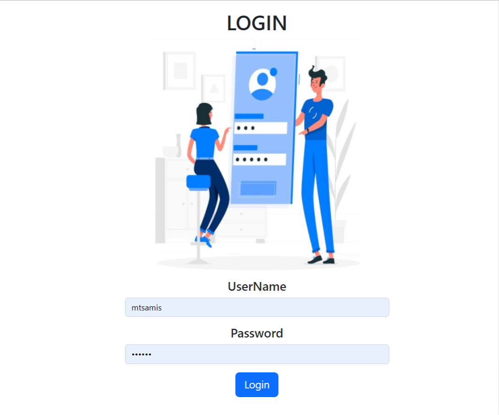
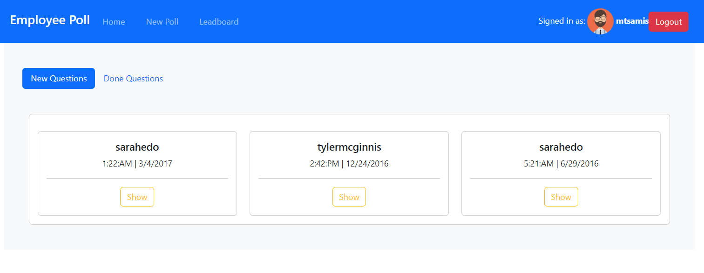
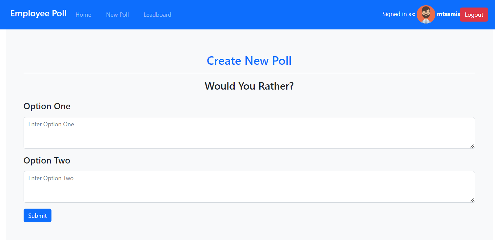
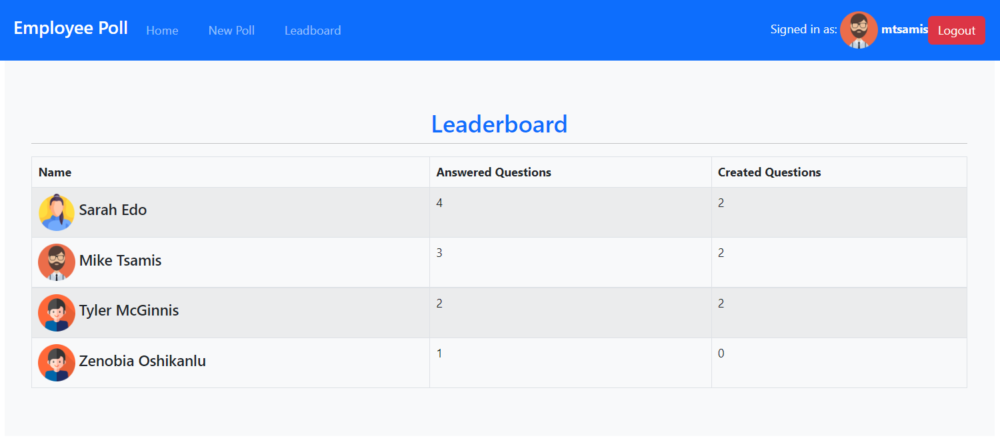

# Employee Polls

This application allows users to create new poll, answer existing polls, and view statistic about users on the leaderboard. 

## Getting Started

 use `npm install` to download needed packages. then, use `npm start` to start the app. 
 For testing use  `npm run test`

 ### Screenshots
 -Login-

 

 -Dashboard-

 

-New Poll-

-Leaderboard-

